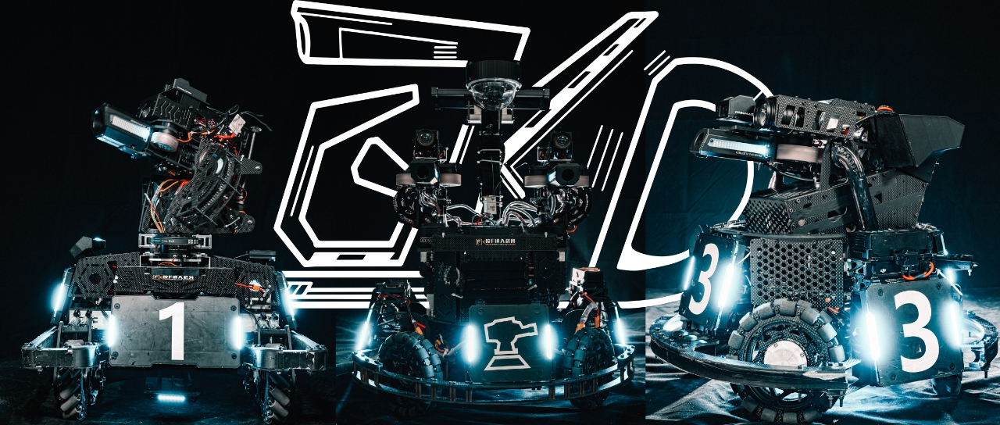

## Hi! This is GKD Robotics Lab!

This organization hosts the open-source repositories of ALL the hardware, software, and algorithms developed by GKD team.
If our work is helpful to you, we would appreciate you following us! Also please remember star the repositories we referenced, thanks!

本组织包含 GKD 战队所有的硬件, 控制, 算法代码开源仓库。如果对您有帮助, 十分感谢您的关注，同时请星标我们所参考的仓库! 谢谢!

更多视频教程及战队日常请关注 b站 账号: [西南大学 GKD 机器人队](https://space.bilibili.com/316407854?spm_id_from=333.337.0.0)

## 各组同学请参考以下仓库学习使用指南
软件组 ( 控制组, 算法组 ): [软件组学习指南](https://github.com/GKD-RM-Lab/GKD_SoftwareLearning)

硬件组: [硬件组学习指南](https://github.com/GKD-RM-Lab/GKD_HardwareLearning)
<!--

**Here are some ideas to get you started:**

🙋‍♀️ A short introduction - what is your organization all about?
🌈 Contribution guidelines - how can the community get involved?
👩‍💻 Useful resources - where can the community find your docs? Is there anything else the community should know?
🍿 Fun facts - what does your team eat for breakfast?
🧙 Remember, you can do mighty things with the power of [Markdown](https://docs.github.com/github/writing-on-github/getting-started-with-writing-and-formatting-on-github/basic-writing-and-formatting-syntax)
-->
